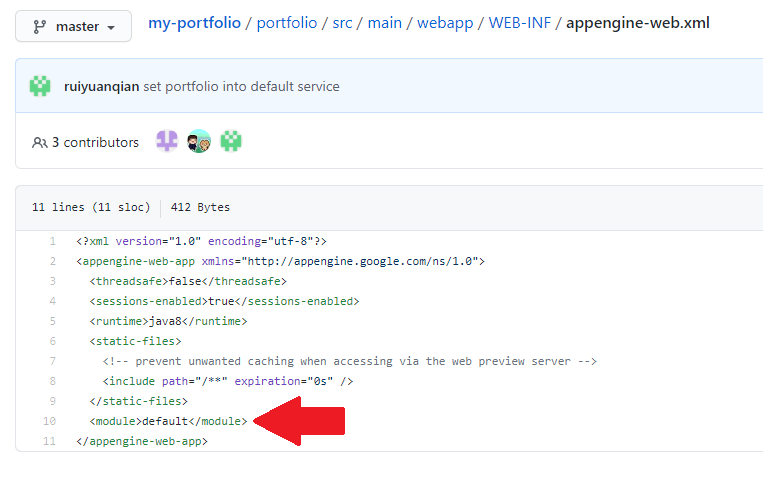

# 0.

关于如何在同一个 project 里创建多个 services （比如在不顶掉 portfolio 的情况下调试 group project ）

# 1. 用 standard 环境

## 1.1 用 maven 提交 java

通过写 app.yaml 可以让程序部署到不同的 services 上。

但使用 maven 的话，app.yaml 是 maven 插件自动生成的。为了改变这个自动生成的 app.yaml ，要改别的配置文件。举例来说，如果想把 portfolio 变成名为 default 的 service ，需要修改 software-product-sprint/portfolio/src/main/webapp/WEB-INF/appengine-web.xml 这个配置文件。

比如下图里，我在 appengine-web.xml 里新增了 `<module>default</module>` ，module 就是 service 的旧称。



想新增别的 service 的话，必须要先有一个 default 的 service 。因此，如果想部署两个 java server，应该就是两步：

a) 在 portfolio 的 appengine-web.xml 里新增 `<module>default</module>` 

b) 第二个 java server 的配置文件里，则把 appengine-web.xml 的 module 改成别的名字


可以参考这个：

https://cloud.google.com/appengine/docs/standard/java/config/appref

## 1.2 不用 maven

不使用maven的话其实很简单的，创建一个简单的 app.yaml ，里面写明 service 名称，然后用命令行部署就行了，比如我的 python server 可以写一个这样的 app.yaml，里面的 service: flask111 意思就是部署到名为 flask111 的 service 上。

```
runtime: python38
service: flask111
entrypoint: KERAS_BACKEND=theano FLASK_APP=main.py flask run
```

之后 gcloud app deploy app.yaml 然后按提示操作就行了

https://stackoverflow.com/questions/46036320/deploy-multiple-applications-from-same-project

# 2. 用 flex 环境和 docker

这个可以用自定义的 docker 镜像，写一个这样的 app.yaml

```
runtime: custom
env: flex
```

然后在 app.yaml 的同目录下放 Dockerfile

之后用 gcloud app deploy app.yaml 然后按命令行提示继续操作就行了

部署成功后也可以 ssh 进去

可以参考：

https://cloud.google.com/appengine/docs/flexible/custom-runtimes/quickstart
